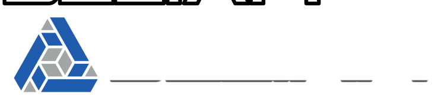
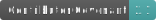

# DeltaFi is the open source platform for data transformation

DeltaFi is a flexible, code-light data transformation and normalization platform that allows you to:
- Manipulate any type of data in any programming language
- Explore and analyze your data
- Monitor data flows with precision metrics, alerting and notifications
- Capture and diagnose errors

## Getting Started

- Go to the [DeltaFi site](https://www.deltafi.org) to see a platform overview
- View the [DeltaFi documentation](https://docs.deltafi.org)
- Try out a demo cluster with the [Demo Cluster Getting Started Guide](https://docs.deltafi.org/#/getting-started/cluster)
- Build a simple plugin with the [Plugin Getting Started Guide](https://docs.deltafi.org/#/getting-started/simple-plugin)
- Contact us at info@deltafi.org for more information
